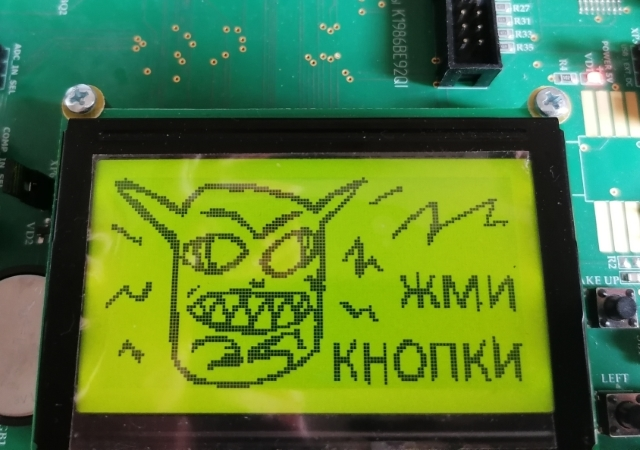

# K1986BE92QI EvalBoard display
## Проект на основе отладочного модуля ТСКЯ.469575.002-01 ф. Миландр
* Цель проекта: создание универсальной библиотеки работы с дисплеем MT-12864 ф. МЭЛТ и/или аналогичных.

